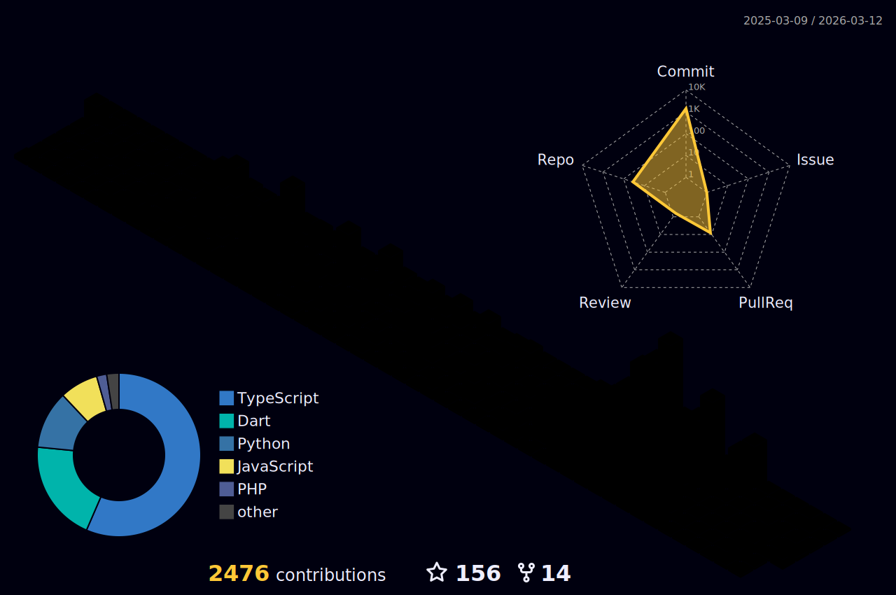

# Mahmoud Hamdy

**Full-Stack Software Engineer | Mobile & Backend Specialist**

---

## About Me

I'm a Full-Stack Software Engineer based in Egypt, specializing in building scalable mobile and backend solutions for the MENA region. Currently working at ROV GROUP on Escore, an esports platform designed for Arabic-speaking markets.

**Current Focus:** Cloud Architecture, DevOps, and AI/ML integration

**Status:** 🟢 Open for opportunities

---

## Core Competencies

### Mobile Development
- **Flutter & Dart** - Cross-platform mobile applications with native performance
- **Android** - Native Android development with Java/Kotlin

### Backend Engineering
- **Node.js & Express** - RESTful APIs and microservices architecture
- **Python (FastAPI, Flask)** - High-performance backend services
- **API Design** - RESTful and GraphQL implementations

### Data & Infrastructure
- **Databases** - MongoDB, PostgreSQL, Firebase, SQLite, Redis
- **DevOps** - Docker, Git, CI/CD pipelines
- **Web Scraping** - Data extraction and automation solutions

---

## Technical Stack

**Languages**

**Frameworks & Tools**

---

## GitHub Statistics

---

## Activity

<picture>
  <source media="(prefers-color-scheme: dark)" srcset="https://raw.githubusercontent.com/mahmoodhamdi/mahmoodhamdi/output/github-snake-dark.svg" />
  <source media="(prefers-color-scheme: light)" srcset="https://raw.githubusercontent.com/mahmoodhamdi/mahmoodhamdi/output/github-snake.svg" />
  
</picture>

---

## Featured Projects

---

## Services Offered

- **Mobile Application Development** - Cross-platform and native mobile solutions
- **Backend API Development** - Scalable RESTful and GraphQL APIs
- **Database Architecture** - Design and optimization for SQL and NoSQL databases
- **Web Scraping & Automation** - Custom data extraction and bot development
- **Technical Consultation** - Architecture planning and code review

---

## Contribution Graph

---

## Let's Connect

I'm available for freelance projects, full-time opportunities, contract work, and technical consultation. Feel free to reach out:

**Email:** [hmdy7486@gmail.com](mailto:hmdy7486@gmail.com)
**WhatsApp:** [+201019793768](https://wa.me/201019793768)
**LinkedIn:** [mahmoud-hamdy-alashwah](https://www.linkedin.com/in/mahmoud-hamdy-alashwah/)

---

**Made with ❤️ by Mahmoud Hamdy**

