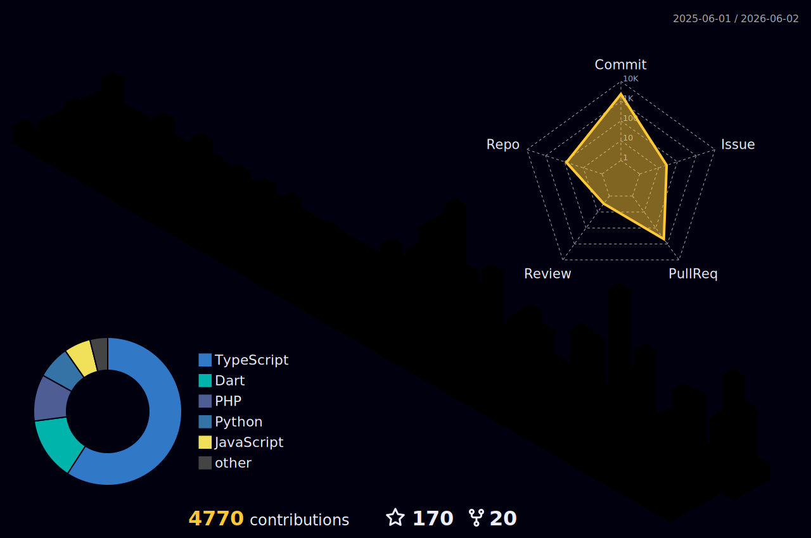

<!--
  GitHub Profile README — mahmoodhamdi
  Theme: Tokyo Night · Cyan #00D9FF · Coral #FF6B6B · BG #0D1117
  All external SVG services and design choices are documented in CLAUDE.md.
-->

<div align="center">

<a href="https://github.com/mahmoodhamdi">
  
</a>

<p>
  
  
  
</p>

<p>
  <a href="https://www.linkedin.com/in/mahmoud-hamdy-alashwah/"></a>
  &nbsp;
  <a href="mailto:hmdy7486@gmail.com"></a>
  &nbsp;
  <a href="https://wa.me/201019793768"></a>
  &nbsp;
  <a href="https://github.com/mahmoodhamdi"></a>
</p>

<p>
  
  
  
</p>

<p>
  
  
  
  
  
</p>

</div>

---

## 🚀 About Me

Full-Stack Software Engineer based in **Egypt**, building scalable mobile and backend systems. Currently engineering **Escore** at **ROV GROUP** — a real-time esports platform serving Arabic-speaking markets across the MENA region.

- 🛠️ **175+ public repositories** · **140+ community stars** on personal open-source work
- 🌐 **Open-source contributor** — merged PRs in **[Zustand](https://github.com/pmndrs/zustand)** (58k★), **[Payload CMS](https://github.com/payloadcms/payload)** (42k★), **[Joi](https://github.com/hapijs/joi)** (21k★), **[dotenv](https://github.com/motdotla/dotenv)** (20k★), **[Dify](https://github.com/langgenius/dify)** (141k★) and more
- 🌍 Specialize in products built for the **MENA region** with bilingual (AR/EN) and **RTL-first** design
- 🎯 Currently focused on **Cloud Architecture, DevOps & AI/ML integration**
- 💼 **Open to freelance, contract & full-time roles** — remote, hybrid, or on-site
- 📬 Reach me anytime: **hmdy7486@gmail.com** · **+20 101 979 3768**

---

## 🔭 Currently Building

<table>
<tr>
<td width="33%" valign="top">

### 🎮 Escore
**Real-time esports platform**
@ ROV GROUP

Live tournament data, team & player profiles, multilingual coverage for Arabic-speaking esports fans across MENA.

`Flutter` `Node.js` `Real-time` `i18n`

</td>
<td width="33%" valign="top">

### 🏢 MWM Software Solutions
**Bilingual corporate CMS**
[mwm](https://github.com/mahmoodhamdi/mwm)

33+ portfolio projects, blog, careers, admin dashboard. Full-stack Next.js 14 + Express + MongoDB.

`Next.js` `Express` `MongoDB` `RTL`

</td>
<td width="33%" valign="top">

### 🛒 TStore
**Production Flutter e-commerce**
[TStore](https://github.com/mahmoodhamdi/TStore)

Clean Architecture · 219 unit tests · Auth, cart, wishlist, orders, reviews, chat, notifications.

`Flutter` `Supabase` `BLoC` `CI/CD`

</td>
</tr>
</table>

---

## 🛠️ Tech Stack

<div align="center">

**Languages**
<br/>


**Mobile & Frontend**
<br/>


**Backend & APIs**
<br/>


**Databases & Infrastructure**
<br/>


</div>

---

## 📊 GitHub Statistics

<div align="center">

<table>
<tr>
<td>

</td>
<td>

</td>
</tr>
</table>


</div>

### ⏱️ Weekly Coding Activity

<!--
  Auto-populated by .github/workflows/waka-readme.yml (runs daily 00:00 UTC).
  Requires WAKATIME_API_KEY in repo Secrets — see CLAUDE.md for setup.
  Until the secret is set, this section will show only the title.
-->

<!--START_SECTION:waka-->

```dart
From: 04 May 2026 - To: 11 May 2026

Total Time: 9 hrs 58 mins

Other         3 hrs 27 mins         ██████▒░░░░░░░░░░░░░░░░░░   25.76 %
TypeScript    2 hrs 43 mins         █████░░░░░░░░░░░░░░░░░░░░   20.27 %
Markdown      2 hrs 35 mins         ████▓░░░░░░░░░░░░░░░░░░░░   19.29 %
JavaScript    1 hr 58 mins          ███▓░░░░░░░░░░░░░░░░░░░░░   14.74 %
PHP           1 hr 48 mins          ███▒░░░░░░░░░░░░░░░░░░░░░   13.49 %
JSON          14 mins               ▒░░░░░░░░░░░░░░░░░░░░░░░░   01.83 %
```

<!--END_SECTION:waka-->

### 🏆 Achievements

<div align="center">

<a href="https://github.com/ryo-ma/github-profile-trophy">
  
</a>

</div>

### 📈 Activity Graph

<div align="center">


</div>

---

## 🌟 Featured Projects

<div align="center">

<table>
<tr>
<td width="50%">
<a href="https://github.com/mahmoodhamdi/Flutter-Developer-Interview-Questions">

</a>
</td>
<td width="50%">
<a href="https://github.com/mahmoodhamdi/TStore">

</a>
</td>
</tr>
<tr>
<td width="50%">
<a href="https://github.com/mahmoodhamdi/flutter_google_workspace_integration">

</a>
</td>
<td width="50%">
<a href="https://github.com/mahmoodhamdi/mwm">

</a>
</td>
</tr>
<tr>
<td width="50%">
<a href="https://github.com/mahmoodhamdi/esports-flask">

</a>
</td>
<td width="50%">
<a href="https://github.com/mahmoodhamdi/Markdown-to-PDF">

</a>
</td>
</tr>
</table>

<a href="https://github.com/mahmoodhamdi?tab=repositories"><strong>→ Browse all 175 repositories</strong></a>

</div>

---

## 🤝 Open Source & Community Impact

<div align="center">

[](https://github.com/amankumarconnect/readme-contribution-stats)

</div>

### Notable Merged Contributions

Specific PRs landed in production open-source projects (sorted by repo prominence):

<!--
  Keep this table sorted by stargazer count — newest contributions in the middle, not at the bottom.
  Type-column badges (use these exact strings for visual consistency):
    
    
    
    
    
-->

| Project | Stars | Contribution | Type | PR |
|---|---:|---|---|---:|
| **[langgenius/dify](https://github.com/langgenius/dify)** | 141k★ | `refactor(web)`: convert 7 enums to as-const objects (batch 5) |  | [#33960](https://github.com/langgenius/dify/pull/33960) |
| **[pmndrs/zustand](https://github.com/pmndrs/zustand)** | 58k★ | `refactor(devtools)`: remove duplicate module augmentation |  | [#3443](https://github.com/pmndrs/zustand/pull/3443) |
| **[pmndrs/zustand](https://github.com/pmndrs/zustand)** | 58k★ | `test`: expand React subscribe test coverage |  | [#3442](https://github.com/pmndrs/zustand/pull/3442) |
| **[payloadcms/payload](https://github.com/payloadcms/payload)** | 42k★ | `fix(richtext-lexical)`: prevent invalid h0 heading nodes when all heading sizes are disabled |  | [#16090](https://github.com/payloadcms/payload/pull/16090) |
| **[payloadcms/payload](https://github.com/payloadcms/payload)** | 42k★ | `fix`: use `instanceof` instead of constructor name in `formatErrors` |  | [#16089](https://github.com/payloadcms/payload/pull/16089) |
| **[hapijs/joi](https://github.com/hapijs/joi)** | 21k★ | `fix`: improve JSON Schema conversion for `number.port()` and `number.sign()` |  | [#3107](https://github.com/hapijs/joi/pull/3107) |
| **[motdotla/dotenv](https://github.com/motdotla/dotenv)** | 20k★ | `fix`: use `DotenvPopulateOptions` for `populate()` third argument type |  | [#998](https://github.com/motdotla/dotenv/pull/998) |
| **[debug-js/debug](https://github.com/debug-js/debug)** | 11k★ | `docs`: remove broken links to deleted examples directory |  | [#1026](https://github.com/debug-js/debug/pull/1026) |
| **[pillarjs/path-to-regexp](https://github.com/pillarjs/path-to-regexp)** | 8.5k★ | `docs`: fix incorrect token type in custom path example |  | [#429](https://github.com/pillarjs/path-to-regexp/pull/429) |
| **[pillarjs/path-to-regexp](https://github.com/pillarjs/path-to-regexp)** | 8.5k★ | `test`: add coverage for `trailing` option set to `false` |  | [#428](https://github.com/pillarjs/path-to-regexp/pull/428) |
| **[jshttp/cookie](https://github.com/jshttp/cookie)** | 1.5k★ | `test`: expand `stringifyCookie` coverage and add roundtrip tests |  | [#266](https://github.com/jshttp/cookie/pull/266) |

> **~304k combined stars** across these projects. [→ See all merged PRs by mahmoodhamdi](https://github.com/pulls?q=is%3Apr+is%3Amerged+author%3Amahmoodhamdi+archived%3Afalse)

---

## 🐍 Contribution Activity

<div align="center">

<picture>
  <source media="(prefers-color-scheme: dark)" srcset="https://raw.githubusercontent.com/mahmoodhamdi/mahmoodhamdi/output/github-snake-dark.svg" />
  <source media="(prefers-color-scheme: light)" srcset="https://raw.githubusercontent.com/mahmoodhamdi/mahmoodhamdi/output/github-snake.svg" />
  
</picture>

### 3D Contribution Graph



</div>

---

## 💼 Services I Offer

<div align="center">

| Service | What I Deliver |
|---|---|
| 📱 **Mobile Development** | Cross-platform Flutter apps · Native Android · Production-ready with full test coverage |
| ⚙️ **Backend Engineering** | RESTful & GraphQL APIs · Microservices · Auth, payments, real-time features |
| 🗄️ **Database Architecture** | SQL & NoSQL design · Schema optimization · Migration strategies |
| 🤖 **Automation & Web Scraping** | Custom bots · Data extraction pipelines · Scheduled jobs |
| ☁️ **Cloud & DevOps** | CI/CD pipelines · Docker · Deployment & monitoring |
| 🧩 **Technical Consultation** | Architecture review · Code audit · Team mentoring |

<br/>

<a href="https://wa.me/201019793768">
  
</a>
&nbsp;
<a href="mailto:hmdy7486@gmail.com">
  
</a>
&nbsp;
<a href="https://www.linkedin.com/in/mahmoud-hamdy-alashwah/">
  
</a>

</div>

---

## 🌐 Let's Connect

<div align="center">

<p><strong>I respond within 24 hours · Available in Arabic & English</strong></p>

<p>
  <a href="https://www.linkedin.com/in/mahmoud-hamdy-alashwah/"></a>
  &nbsp;
  <a href="mailto:hmdy7486@gmail.com"></a>
  &nbsp;
  <a href="https://wa.me/201019793768"></a>
  &nbsp;
  <a href="https://github.com/mahmoodhamdi"></a>
</p>

<sub>⭐ If my work is useful to you, consider starring a repo or two. Thanks for visiting!</sub>

</div>
